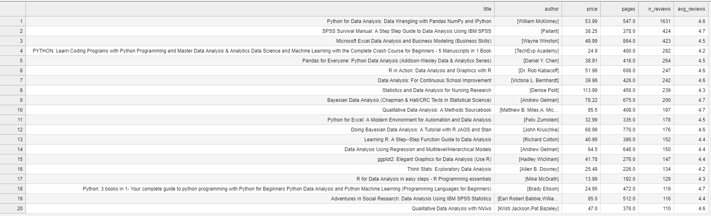
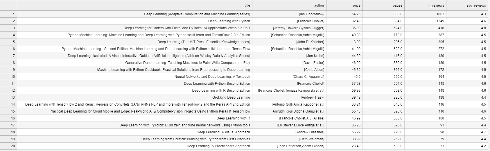

##  **The objective of this project is to select the best-rated books on Amazon in the​​ Data Science subset** 

#### [Best_Statistics_books](Best_tables_csvs/Best_Statistics_books.csv)

#### [Best_python_books](Best_tables_csvs/Best_python_books.csv) 

#### [Best_Data_Analysis_books](Best_tables_csvs/Best_Data_Analysis_books.csv) 

#### [Best_Data_Science_books](Best_tables_csvs/Best_Data_Science_books.csv)   

#### [Best_Machine_Learn_books](Best_tables_csvs/Best_Machine_Learn_books.csv) 

#### [Best_Deep_Learn_books](Best_tables_csvs/Best_Deep_Learn_books.csv)  

---

**Referências**

link para o dataset keggle : https://www.kaggle.com/datasets/patrickgomes/pybooks-amazon?select=Pybooks.csv

link para o dataset no deepnote: https://deepnote.com/workspace/thu-70b82642-3f7e-4ef4-8203-d96ba4531278/project/Data-science-book-analysis-95de68e6-99de-4ef6-b3ae-d76602c45655/notebook/Notebook%201-0bf2948ac9304e31a1360fa7d16e5d48?

- Este dataset faz parte de um projeto tutorial de exploração de dados do canal da thuvu analytics, assim contendo menos valores núlos em algumas categorias, a diferença é relativamente pequena mas por conveniência vamos usar esse dataset em questão.

link vídeo thuvu: https://www.youtube.com/watch?v=N0o-Bjiwt0M&t=373s&ab_channel=ThuVudataanalytics

---

##### Variáveis

- 'title': O título do livro.
- 'author': O autor do livro.
- 'price': O preço do livro, geralmente em moeda local.
- 'price (including used books)': O preço do livro, incluindo livros usados, pode fornecer uma visão do custo total ou desconto para livros usados.
- 'pages': O número de páginas no livro.
- 'avg_reviews': A média das avaliações do livro.
- 'n_reviews': O número total de avaliações do livro.
- 'star5', 'star4', 'star3', 'star2', 'star1': O número de avaliações de 5 estrelas, 4 estrelas, 3 estrelas, 2 estrelas e 1 estrela, respectivamente. Esses podem ser usados para analisar a distribuição das avaliações.
- 'dimensions': As dimensões físicas do livro (altura x largura x comprimento).
- 'weight': O peso do livro.
- 'language': O idioma em que o livro foi escrito.
- 'publisher': A editora que publicou o livro.
- 'ISBN_13': O número de identificação único de 13 dígitos associado ao livro (ISBN).
- 'link': Um link relacionado ao livro, talvez para a página do livro em uma loja online.
- 'complete_link': Um link completo que pode incluir informações adicionais ou redirecionar para a página principal.

---

